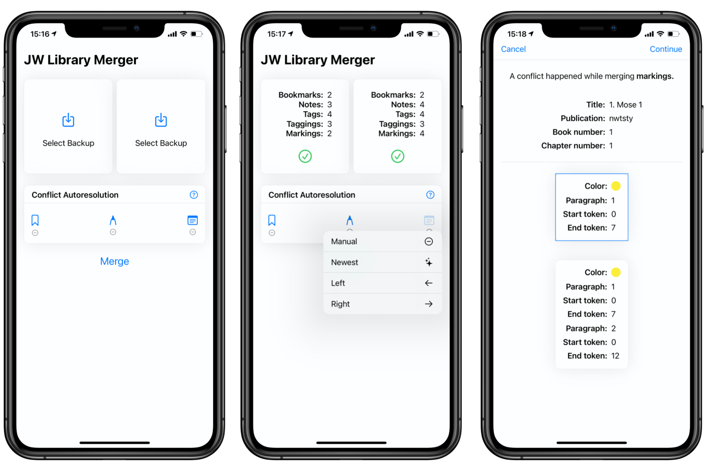

# JWLM - Easily merge JW Library backups in iOS

JWLM is an iOS app that allows you to merge two JW Library backups. It wraps the
merge logic of [go-jwlm](https://github.com/AndreasSko/go-jwlm) (the CLI
version) into an easy to use app. 

Both projects are still in beta phase, so there is a chance that you may spot a bug
while using it (see [A word of
caution](https://github.com/AndreasSko/go-jwlm#a-word-of-caution)). If you want
to be part of the Beta test of JWLM, feel free to join the TestFlight group
[here](https://testflight.apple.com/join/lMl8Gsc2).

If you found a bug in the app, feel free to open an issue. If it might have something
to do with the merge logic itself, it may be better to open the issue on the
[go-jwlm](https://github.com/AndreasSko/go-jwlm) repository.

